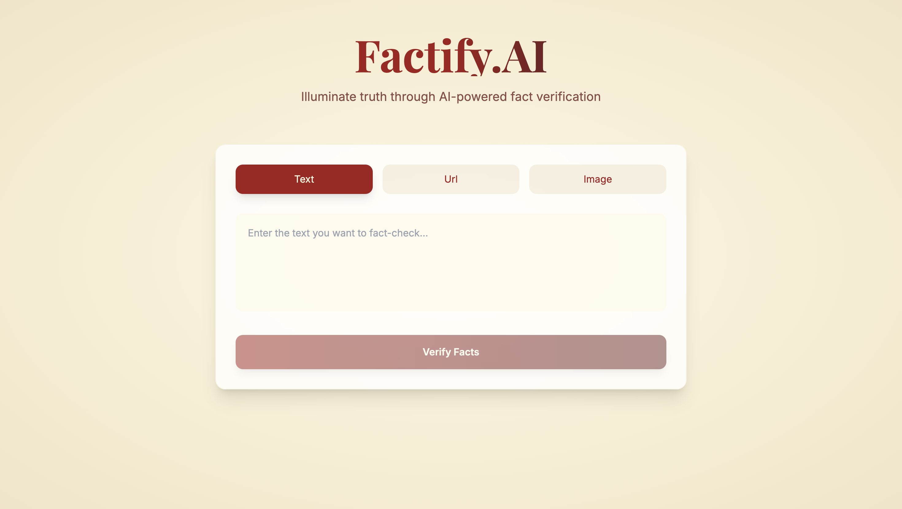
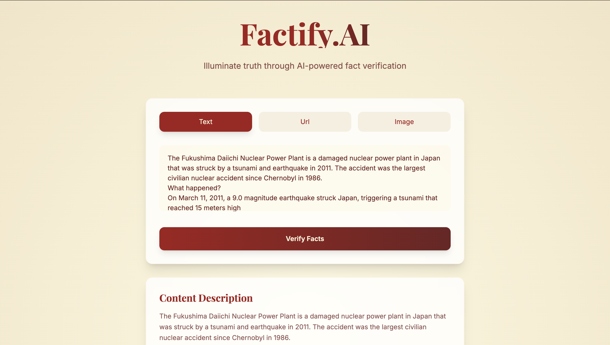
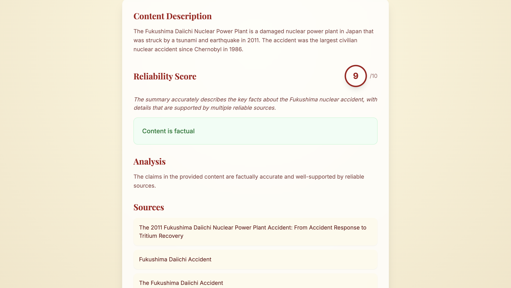
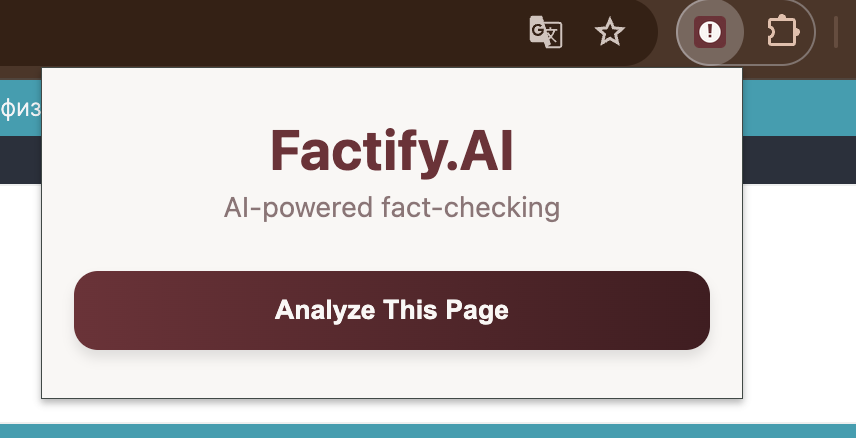
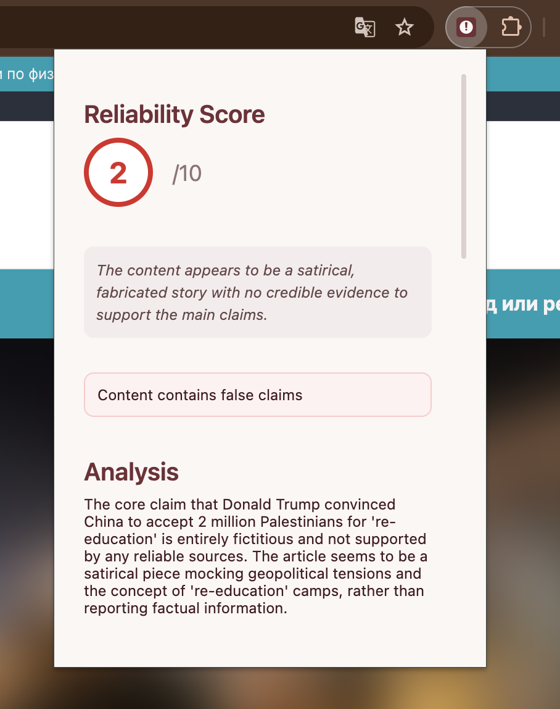

# Factify.AI

[](https://nextjs.org/)
[](https://www.typescriptlang.org/)
[](https://tailwindcss.com/)
[](https://developer.chrome.com/docs/extensions/reference/)
[](https://opensource.org/licenses/MIT)

An AI-powered fact-checking solution available as both a web application and browser extension. Leveraging Claude's advanced language understanding to analyze content and verify claims in real-time. Whether you're checking news articles, social media posts, or images, this tool helps combat misinformation by providing accurate, source-backed analysis.

## Screenshots

### Web Application Interface

*Clean, modern landing page with our mission statement*


*Flexible input interface supporting text, URL, and image fact-checking*


*Comprehensive analysis with reliability score, factual assessment, and verified sources*

### Chrome Extension

*Chrome extension popup ready to analyze the current page*


*Extension showing fact-check results with reliability score and analysis*

## Features

- Available as both web app and Chrome extension
- Real-time webpage content analysis
- Multi-input support (text, URLs, and images)
- Reliability scoring (1-10 scale)
- Detailed analysis of claims
- False claim detection and correction
- Source verification with links
- Modern, responsive UI with animations
- Real-time analysis using Claude

## Usage Options

### Web Application
Access the full-featured web application for more flexibility:
1. Visit [http://localhost:3000](http://localhost:3000) (when running locally)
2. Choose your input type (text, URL, or image)
3. Enter or upload your content
4. Click "Check Facts"
5. View the detailed analysis, including:
   - Reliability score
   - Factual assessment
   - Detailed analysis
   - False claims and corrections
   - Verified sources

### Chrome Extension
Use the convenient browser extension for quick webpage analysis:
1. Click the extension icon in your toolbar
2. The extension will automatically analyze the current page
3. View reliability score, false claims, and verified sources in the popup

## Setup

### Prerequisites
- Node.js 18+ installed
- Anthropic API key
- Chrome browser (for extension)
- Local development server (for both web app and extension)

### Web Application Setup
1. Clone the repository
2. Install dependencies:
   ```bash
   npm install
   ```
3. Create a `.env.local` file and add your API key:
   ```
   ANTHROPIC_API_KEY=your_api_key_here
   ```
4. Run the development server:
   ```bash
   npm run dev
   ```
5. Open [http://localhost:3000](http://localhost:3000) in your browser

### Chrome Extension Setup
1. Complete the web application setup first (steps 1-4 above)
2. Enable Chrome Developer Mode:
   - Open Chrome and go to `chrome://extensions/`
   - Toggle "Developer mode" in the top right
3. Load the Extension:
   - Click "Load unpacked"
   - Select the `extension` directory from this project
   - The extension icon should appear in your toolbar

## Development Commands

```bash
# Install dependencies
npm install

# Run development server (required for both web app and extension)
npm run dev

# Build for production
npm run build

# Start production server
npm start

# Run linting
npm run lint

# Run type checking
npm run typecheck
```

## Technology Stack

- Next.js 14 (Web Application)
- TypeScript
- Tailwind CSS
- Framer Motion
- Chrome Extension API (V3)
- Anthropic Claude API
- Cheerio for web scraping
- Axios for HTTP requests

## Project Structure

```
factcheck/
├── src/                        # Source files for web application
│   ├── app/                    # Next.js app directory
│   │   ├── api/               # API routes
│   │   │   └── factcheck/     # Fact-checking endpoint
│   │   ├── components/        # React components
│   │   ├── styles/           # Global styles
│   │   └── page.tsx          # Main web app page
│   ├── lib/                   # Shared utilities
│   └── types/                 # TypeScript type definitions
├── extension/                 # Chrome extension files
│   ├── popup/                # Extension popup interface
│   │   ├── popup.html       # Popup HTML
│   │   ├── popup.css        # Popup styles
│   │   └── popup.js         # Popup logic
│   ├── content.js           # Content script for webpage analysis
│   ├── background.js        # Service worker background script
│   ├── manifest.json        # Extension configuration
│   └── icons/              # Extension icons
├── public/                  # Static assets
├── docs/                    # Documentation and images
│   └── images/             # Screenshot and images
├── package.json            # Project dependencies and scripts
├── tsconfig.json           # TypeScript configuration
├── tailwind.config.js      # Tailwind CSS configuration
└── README.md              # Project documentation
```

### Key Directories

- **`src/`**: Contains the web application code
  - `app/`: Next.js application code and API routes
  - `components/`: Reusable React components
  - `lib/`: Shared utilities and helper functions
  - `types/`: TypeScript type definitions

- **`extension/`**: Chrome extension-specific code
  - `popup/`: Extension popup interface files
  - `content.js`: Handles webpage content extraction
  - `background.js`: Manages extension lifecycle
  - `manifest.json`: Extension configuration

- **`public/`**: Static assets for the web application
- **`docs/`**: Documentation and media assets

### Main Components

1. **Web Application**
   - `page.tsx`: Main web interface with input options
   - `api/factcheck/`: Handles fact-checking requests
   - `components/`: UI components for analysis display

2. **Chrome Extension**
   - `popup.{html,css,js}`: Extension popup interface
   - `content.js`: Webpage content extraction
   - `background.js`: Extension event handling

3. **Shared Resources**
   - `lib/`: Common utilities used by both web and extension
   - `types/`: Shared TypeScript interfaces and types

## Architecture

### Web Application
The web app provides a full-featured interface with:
- Direct text input
- URL analysis
- Image upload and analysis
- Detailed results display
- Source verification
- Interactive UI elements

### Chrome Extension
The extension consists of several key components:
- `manifest.json`: Extension configuration and permissions
- `popup.html/css/js`: Extension UI and interaction logic
- `content.js`: Webpage content extraction
- `background.js`: Service worker for extension events

#### Content Script Features
- Extracts main article content
- Removes ads and irrelevant elements
- Handles dynamic content loading
- Sanitizes text for analysis

#### Background Script Features
- Manages extension lifecycle
- Handles tab events
- Coordinates content script injection

## Contributing

Contributions are welcome! Please feel free to submit a Pull Request. For major changes:

1. Fork the repository
2. Create a feature branch
3. Make your changes
4. Submit a PR with a clear description

## Troubleshooting

### Common Issues

1. **API Key Issues**
   - Ensure your Anthropic API key is correctly set in `.env.local`
   - Verify the API key has sufficient credits
   - Check if the API key has the necessary permissions

2. **Web Application Issues**
   - Check if the development server is running
   - Verify the correct port (3000) is available
   - Check browser console for errors
   - Verify environment variables are loaded

3. **Extension Loading Issues**
   - Verify Developer mode is enabled
   - Check for console errors in the extension
   - Ensure the manifest.json is valid
   - Verify all extension files are in the correct location

4. **Content Analysis Issues**
   - Check if the webpage is accessible
   - Verify the content script is injecting properly
   - Check network requests in DevTools
   - Ensure the local server is running

5. **Build Errors**
   - Clear the `.next` folder and node_modules: `rm -rf .next node_modules`
   - Reinstall dependencies: `npm install`
   - Ensure you're using Node.js 18+: `node --version`

### Still Having Issues?
Open an issue on GitHub with:
- Your environment details (Node.js version, OS, Chrome version)
- Steps to reproduce the problem
- Error messages and logs
- Extension console output (if applicable)

## License

MIT License - feel free to use this project for any purpose.

## Note

This project requires an Anthropic API key to function. Make sure to replace `your_api_key_here` in the `.env.local` file with your actual Anthropic API key.
